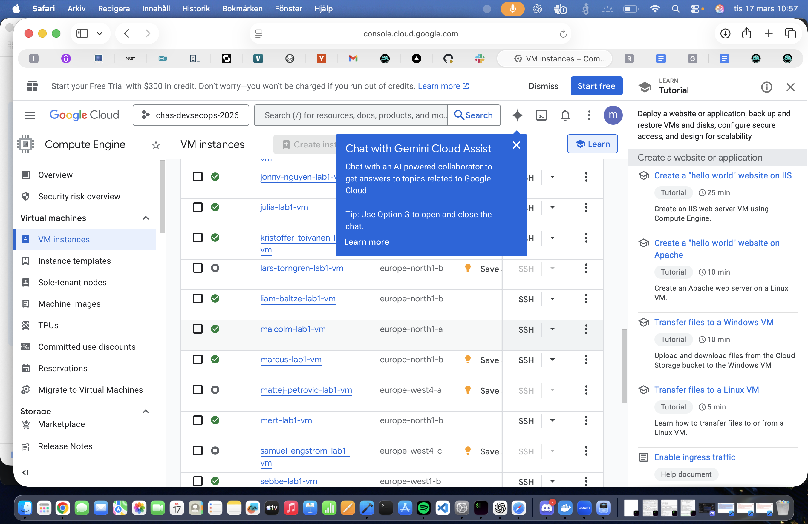
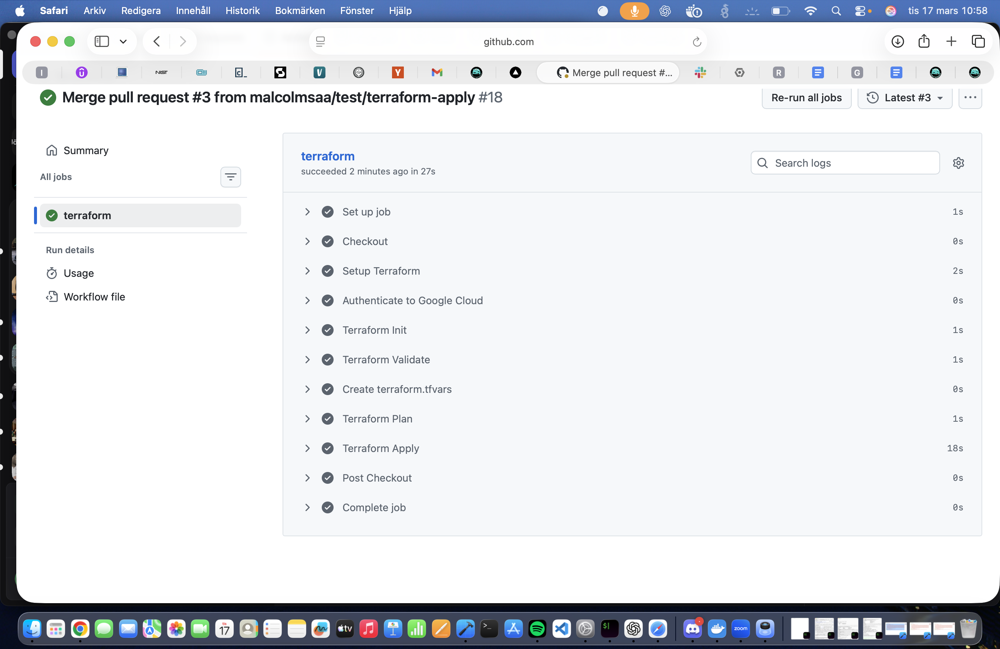
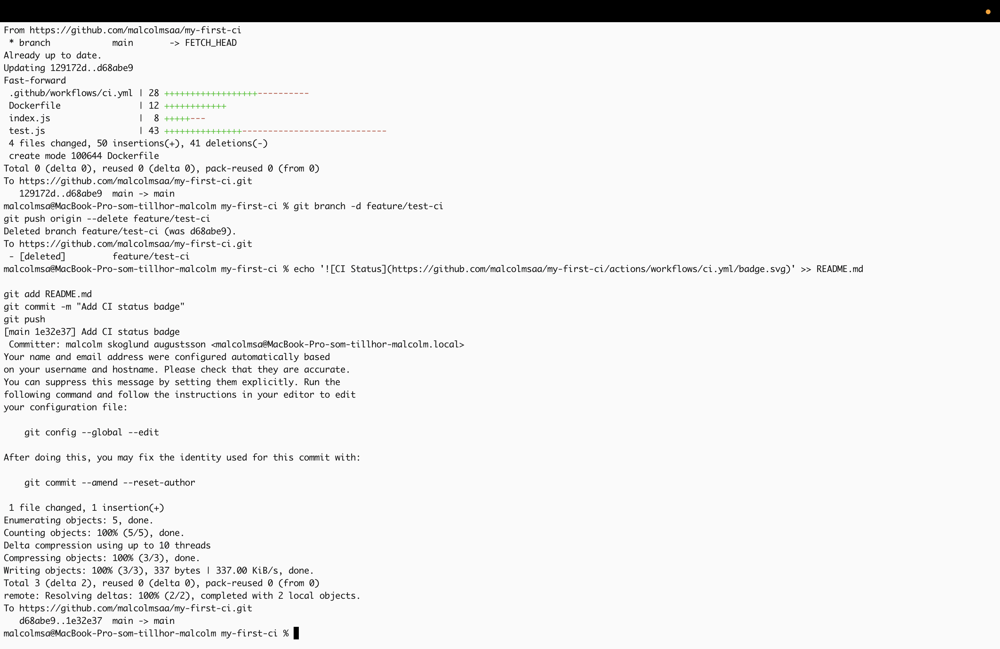

# Lab 1 Terraform

This project provisions a virtual machine in Google Cloud Platform using Terraform.

## What the project does

The Terraform configuration creates a Google Compute Engine VM in the project `chas-devsecops-2026`.  
It also applies a daily snapshot backup policy and uses a startup script for basic hardening.

## Files

- `main.tf` , main Terraform configuration
- `variables.tf` , input variables
- `outputs.tf` , Terraform outputs
- `startup.sh` , startup hardening script
- `.github/workflows/terraform.yml` , CI pipeline

## How to run

```bash
terraform init
terraform validate
terraform plan
terraform apply

## Screenshots

### Terraform pipeline (GitHub Actions)
### GitHub Actions pipeline


### VM i GCP


### Kod / Terraform

